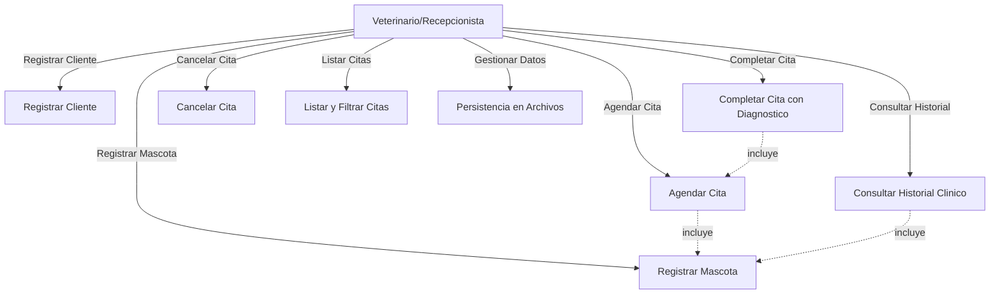
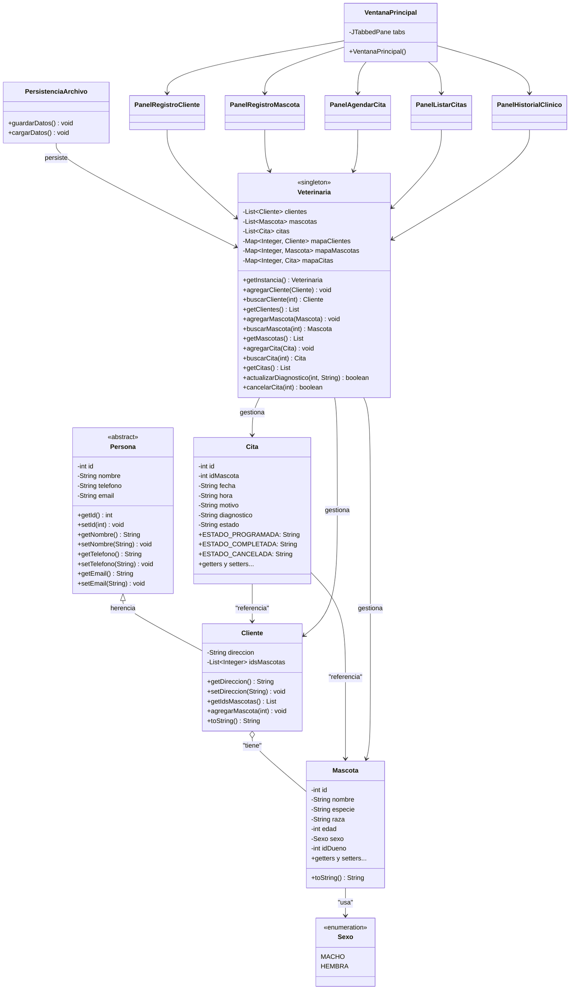

# Diagramas UML - VetCare

## 1. Diagrama de Casos de Uso

### Descripción de Actores

| Actor | Descripción |
|-------|-------------|
| **Veterinario** | Profesional que atiende a las mascotas, completa citas y consulta historiales |
| **Recepcionista** | Personal administrativo que registra clientes, mascotas y agenda citas |

## 2. Diagrama de Clases

## 3. Descripción de la Arquitectura

### Capas del Sistema

| Capa | Paquete | Responsabilidad |
|------|---------|-----------------|
| **Modelo** | `vetcare.model` | Clases del dominio: Persona, Cliente, Mascota, Cita, Sexo |
| **Datos** | `vetcare.data` | Lógica de negocio (Veterinaria) y persistencia (PersistenciaArchivo) |
| **Presentación** | `vetcare.gui` | Interfaz gráfica Swing: VentanaPrincipal y paneles |
| **Aplicación** | `vetcare` | Punto de entrada (VetCareApp) |

### Patrones de Diseño Utilizados

| Patrón | Ubicación | Justificación |
|--------|-----------|---------------|
| **Singleton** | `Veterinaria` | Garantiza una única instancia del gestor central de datos accesible desde toda la aplicación |
| **MVC** | Todo el sistema | Modelo (model + data), Vista (gui), Controlador (Veterinaria actúa como controlador) |
| **Template Method** | `Persona` (abstracta) | Define estructura base que `Cliente` extiende |
